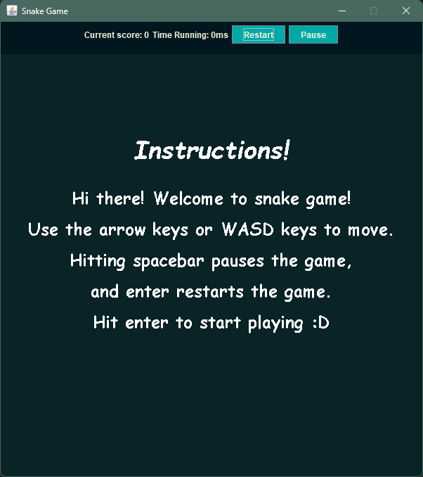
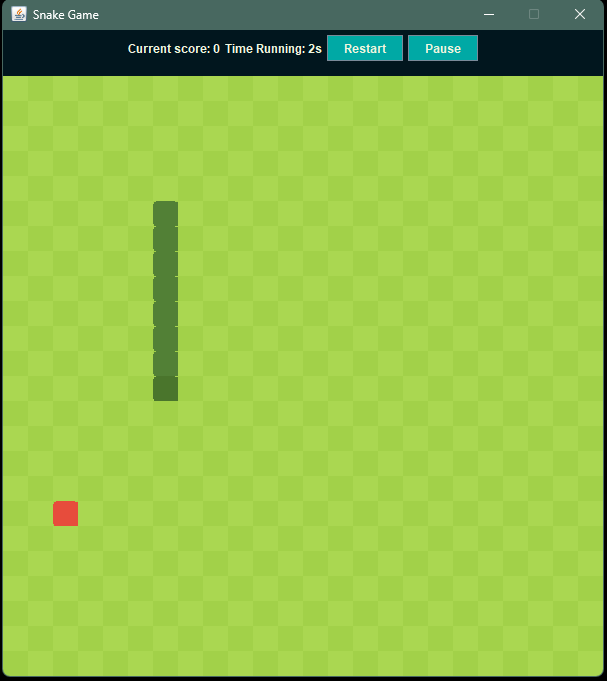
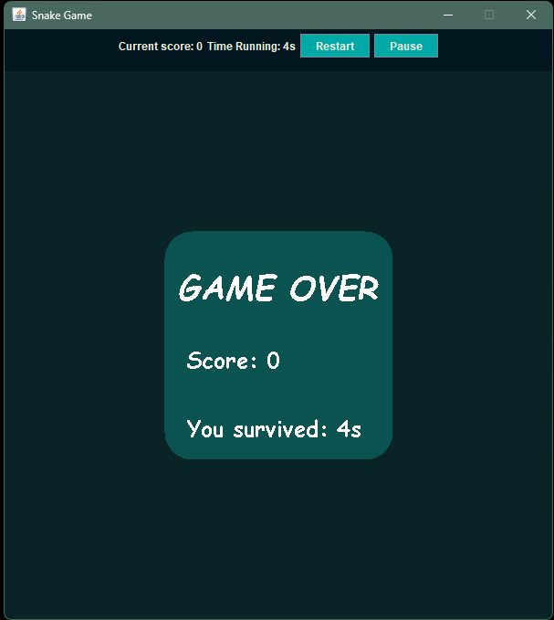

# Snake Game

A classic Snake game built using Java and Swing. The player controls a snake that moves around a grid, eating randomly generated apples to grow longer and increase their score. The game tracks both score and survival time while providing pause, resume, and restart functionality.

## Screenshots

### Home Screen



### Gameplay



### Game Over



## Features

* Smooth grid-based snake movement
* Random apple generation
* Snake growth after eating apples
* Score tracking
* Survival time tracking
* Collision detection

  * Wall collision
  * Self-collision
* Multiple game states

  * Home
  * Running
  * Paused
  * Game Over
* Pause/Resume functionality
* Restart functionality

## Controls

| Key   | Action         |
| ----- | -------------- |
| W / ↑ | Move Up        |
| A / ← | Move Left      |
| S / ↓ | Move Down      |
| D / → | Move Right     |
| Space | Pause / Resume |
| Enter | Restart        |

## Technologies Used

* Java
* Java Swing
* Java AWT

## Project Structure

### Package: `entity`

#### `Apple`

Responsible for:

* Apple positioning
* Random apple generation

#### `Snake`

Extends the base `Entity` class.

Responsible for:

* Snake positioning
* Managing the snake body using `Deque<Point>`
* Providing access to snake data

---

### Package: `gamewindow`

#### `GamePanel`

Main drawing surface where the game is displayed.

#### `Engine`

Handles the core game logic:

* Snake movement updates
* Apple generation
* Collision detection
* Apple consumption checks
* Score updates
* Survival time updates
* Game state management

#### `Renderer`

Responsible for rendering:

* Snake
* Apples
* User interface elements
* Different game states

#### `InputHandler`

Handles keyboard input and key bindings.

---

### Game States

The game operates using four states:

* Home
* Running
* Paused
* Game Over

### `GameWindow`

Main application window.

Responsible for:

* Creating and displaying the game window
* Hosting the `GamePanel`
* Displaying score and survival time
* Managing pause/play and restart controls

## Design Notes

* The project follows separation of concerns by isolating game logic, rendering, and input handling into dedicated classes.
* Snake body segments are stored using a `Deque<Point>` for efficient head and tail operations.
* Game states are managed independently to simplify screen transitions and user interaction.
* Rendering and game updates are separated to keep the codebase organized and maintainable.

## Running the Game

Run the executable JAR:

```cmd
java -jar runnable_snake_game.jar
```

## Future Improvements

* High score system
* Sound effects
* Improved sprites and animations
* Adjustable difficulty levels
* Settings menu
* Persistent score storage
